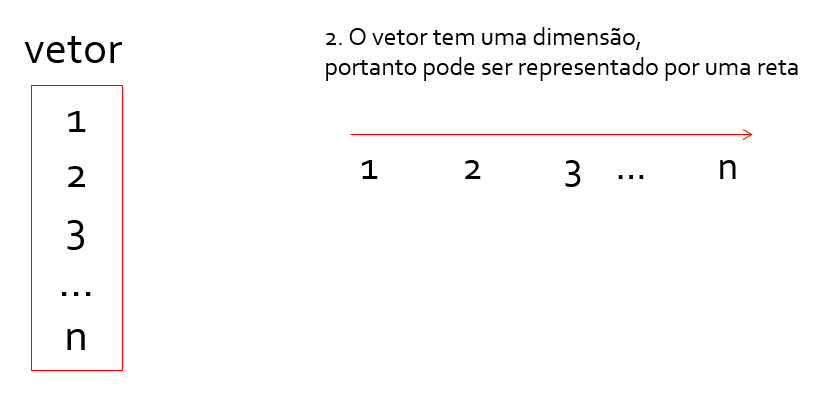
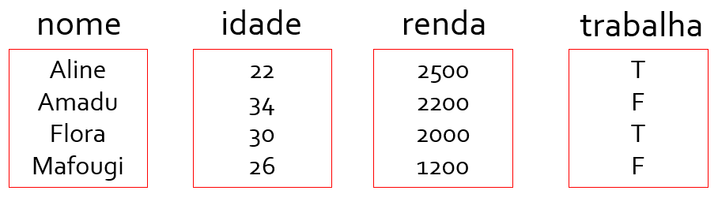
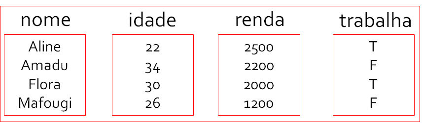

```{r setup, include=FALSE}
# Packages and setup -----------------------------------------------
library(pacman)
p_load("devtools","xaringanthemer")
#devtools::install_github('yihui/xaringan')

style_mono_accent(base_color = "#43418A")

```

## Aula 01 - Introdução

##### 0. [Instruções do curso: Github](https://github.com/victorgalcantara/R-Introduction)
##### 1. [História R e RStudio/Posit](#3)
##### 2. [Instalação e Setup](#5)
##### 3. Janelas e fluxo de trabalho
##### 5. Operações básicas: lógica, cálculo e iterações
##### 4. Vetores e data.frame

---
# História R

**R CRAN**
- R: inicialmente desenvolvido como open source por Ross
Ihaka and Robert Gentleman na _University of Auckland (NZ)_ nos anos 90
- Inspirações: Scheme (1975) e S language (1985)
- S: linguagem desenvolvida no Bell Labs ~1976 por John Chambers, Rick Becker, and Allan Wilks. Primeira linguagem estatística com código aberto ( _open source_ );
- Desde 1997 desenvolvido por R Development Core Team.

Breve histórico:

- 1993: first share of binary copies in mail list “s-news“
Martin Mächler (University of Zurich)
- jun/1995: source code available by ftp under the terms of the Free Software Foundation’s GNU general license.
- Sep/1996: publication of “R: A Language for Data Analysis and Graphics”
- 1997: foundation of “core group” who can make changes to the source code
- fev/2002: R version 1.0

---
# História RStudio/Posit

**RStudio/Posit**
- Ambiente de desenvolvimento integrado ( _Integrated Development Environment - IDE_ )
- Fundada em 2009 por [Joseph J. Allaire](https://en.wikipedia.org/wiki/Joseph_J._Allaire);
- Em 2011 se consolidou como IDE para R e foi rapidamente incorporada pela comunidade de usuários;
- Em 2019 passou a integrar Python e hoje está entre as mais usadas.
- Mudança para Posit em 2022

Impulsiona o uso de softwares livres para análise de dados, oferece condições, confiança e segurança para programação por humanos. Atualmente é mantida pela receita de consumidores de funções adicionais (nuvem, suportes etc.).

---
# Por quê usar R e RStudio?
--

<b>Potência:</b> podemos fazer (quase) tudo com R, considerado uma das melhores ferramentas para estatística e análise de dados. Excel e SPSS estão anos atrás!<br>

--

<b>Código livre, gratuito e universal:</b> não pagamos para usar e podemos ter controle sobre o que estamos fazendo em termos de processamento.<br>

--

<b>Popularidade:</b> movido por uma comunidade internacional extensa, que desenvolve e acompanha o software constantemente. Cada vez mais adotado em instituições (principalmente públicas) e pela comunidade acadêmica<br>

--

<b>Ciência aberta! Replicabilidade, transparência e "fairness":</b> práticas fundamentais e cada vez mais impulsionadas por revistas e instituições acadêmicas!<br>

---

# R vs Python

Algumas diferenças entre **R** (esq.) e **Python** (dir.):

.pull-left[
1. Linguagem voltada para a estatística \\ Funções e sintaxe mais próximo da matemática/estatística;

1. Comunidade mais acadêmica;

1. Mais usado para trabalho com dados estruturados;

1. Biblioteca de pacotes e funções extensa, mas com muitos inativos após atualizações;

]

.pull-right[
1. Linguagem voltada para programação \\ Funções e sintaxe mais próxima da programação em Web (html, css, JS);

1. Comunidade mais corporativa;

1. Usado para dados estruturados, mas mais aberto para dados não estruturados e _big data_;

1. Biblioteca extensa e comunidade muito ativa;<sup>*</sup>

]

---
# Instalação e setup

Faça o download e instalação do R e RStudio de acordo com o seu sistema

[Repositório RCRAN (Comprehensive R Archive Network)](https://cran.r-project.org/)

[Plataforma Rstudio/Posit](https://posit.co/)

---

class: middle, center

# Mão na massa!

---
# Vetores

1. Por definição, vetores são colunas que guardam informações.

--

vetor = { 1, 2, 3, ... , n }  

no R: vetor = c(1,2,3,...,n)

--


---

## Criando um vetor no R

```{r}
# Criando um vetor

nome = c("Aline","Amadu","Flora","Mafougi")

# Observando o vetor
nome
```

```{r}
# Observando um valor em uma posição

nome[3]
```

---

3. Vetores guardam um tipo ou classe de informação

É importante saber a definição da classe do vetor, pois é ela que define as possibilidades de manuseio. Como na estatística, as classes de variáveis definem o que é possível de ser feito.

As mais importantes são:
- **CHR**: “character” = caracteres/texto
- **NUM**: “numeric” = números reais (incluso decimais)
- **INT** : “integer” = números inteiros
- **LOG**: “logical” = lógica Verdadeiro/Falso
	
- **ORD**: “ordered” = texto ordenado 

---

```{r}
idade <- c(22,34,30,26)
renda <- c(2500,2200,2000,1200)
trabalha <- c(T,F,T,F)

class(nome)
class(idade)
class(renda)
class(trabalha)
```

---



1. Data frame é um conjunto de vetores com dimensões iguais



---

Definição de data.frame no R

```{r}
meus_dados <- data.frame(nome,idade,renda,trabalha)

meus_dados

class(meus_dados)

# Acessando informações na minha base de dados
meus_dados[1,1]

meus_dados[1,]
```

---

```{r}
meus_dados
```

meus_dados[2,3] ???

--

```{r}
meus_dados[2,3]
```

---

## Funções importantes

**Subseting**: acessar informações em um data frame

meus_dados[ **Linha**, **Coluna** ] OU meus_dados**$**Coluna

```{r}
meus_dados[1,"nome"]

meus_dados$nome[1]
```

---

**Select**: selecionar variável

```{r}
meus_dados[,"nome"]

meus_dados$nome

subset(x = meus_dados,select = "nome")
```

---

**Filter**: filtrar casos
```{r}
subset(x = meus_dados,subset = renda > 2000)

meus_dados[ , "nome" ] == "Amadu"

meus_dados$renda > 2000
```

---

# Pacote Tydiverse

```{r}
# install.packages(tidyverse)
library(tidyverse)
```

---

## Verbos importantes

### Select e Filter
```{r}
select(.data = meus_dados,nome)

filter(.data = meus_dados,renda > 2000)
```

---

## Rename e Recode

```{r}
rename(.data = meus_dados,"trab"=trabalha)

mutate(.data = meus_dados,ln_renda = log10(renda))
```

---

```{r, include=FALSE}
library(plotly)
Scatter <- plot_ly(data = meus_dados, 
                   x = ~idade, 
                   y = ~renda, 
                   color = ~nome,
                   type = 'scatter', 
                   mode = 'markers') %>%
    layout(xaxis = list(title = "Idade"),
           yaxis = list(title = "Renda")) 

```

```{r}
Scatter
```

---

```{r}
meus_dados[,"educ"] <- c(12,9,16,10)
```

--

```{r, include=FALSE}
Scatter <- plot_ly(data = meus_dados, 
                   x = ~idade, 
                   y = ~renda,
                   z = ~educ,
                   color = ~nome,
                   #type = 'scatter', 
                   mode = 'markers') %>%
    layout(xaxis = list(title = "Idade"),
           yaxis = list(title = "Renda"),
           zaxis = list(title = "Escolaridade")) 

```

```{r,message=FALSE}
Scatter
```

---

```{r, include=F}
library(leaflet)
```

```{r}
leaflet() %>% addTiles() %>% setView(174.7626,-36.8524, zoom = 10)
```

---

# Importando bases

## Pacote RIO (R Input Output)

```{r include=FALSE}
library(rio)
library(DT)
```

```{r}
bd <- rio::import("G:/Meu Drive/00 GitHub/R-Introduction/A01 - Intro/00 data/EF_II_sp_2019.csv")

mydata <- bd %>% select(Escola,rede,ideb,NSE10)
```

---

```{r}
str(mydata)

# Removendo missing data (NA)
mydata <- na.exclude(mydata)

str(mydata)
```

---

```{r}
summary(mydata)

```

---

```{r }
DT::datatable(head(mydata, 20),
              fillContainer = FALSE, 
              options = list(pageLength = 3))
```

---

Escolas que oferecem anos finais do EF no município de SP

```{r, include=FALSE}
Scatter <- plot_ly(data = mydata, 
                   y = ~ideb,
                   x = ~NSE10, 
                   color = ~rede,
                   text = ~Escola,
                   type = 'scatter', 
                   mode = 'markers') %>%
    layout(yaxis = list(title = "Ideb"),
           xaxis = list(title = "NSE"))

# Linear Reg Fit

y <- mydata$ideb
x <- mydata$NSE10

lm_model <- lm(y ~ x) 

y = y=predict(lm_model,x=x)

Scatter <- Scatter %>% add_trace(x = x, y = y, name = 'Regression Fit', 
                      mode = 'lines', alpha = 1,
                      line = list(color = "blue"))

```

```{r, warning=F,message=F}
Scatter
```

