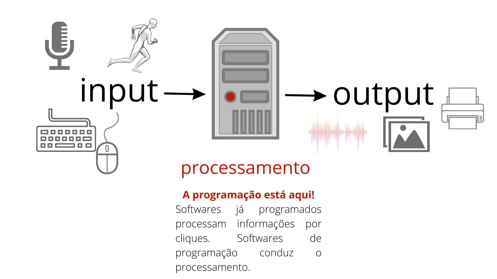
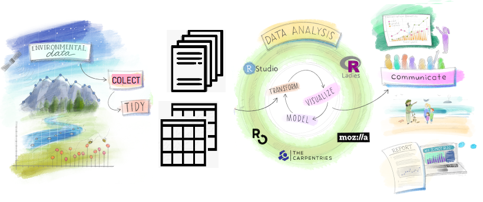

```{r setup, include=FALSE}
# Packages and setup -----------------------------------------------
library(pacman)
p_load("devtools","xaringanthemer")
devtools::install_github('yihui/xaringan')

style_mono_accent(base_color = "#43418A")

wd <- "G:/Meu Drive/00 GitHub/R-Introduction/R-Intro_Aula-01_files"
setwd(wd)
options(htmltools.dir.version = FALSE)
```

# O que é programação?

---
# O que é R?
R é um software livre e uma linguagem de programação voltada à computação estatística e representação gráfica.
#### O R possibilita:
- Importar dados (diversos formatos e origens);
- Manipular dados (processar,limpar,formatar etc.);
- Analisar dados;
- Representar informações graficamente.

**RStudio/Posit** é uma IDE (ambiente de desenvolvimento integrado, do inglês _Integrated Development Environment_).

**Setup:** intalar primeiro o [R base](https://cran.r-project.org/) (i.e. o software/linguagem) e depois o [RStudio](https://www.rstudio.com/products/rstudio/download/#download) (ambiente de desenvolvimento). Trabalharemos com o RStudio, mas precisamos ter o R instalado para o ambiente funcionar.

---
# O processo da pesquisa

---
# História R e RStudio

**R CRAN**
- S: linguagem desenvolvida no Bell Labs ~1976 por John Chambers, Rick Becker, and Allan Wilks. Primeira linguagem estatística com código aberto ( _open source_ );
- R: inicialmente desenvolvido como open source por Ross
Ihaka and Robert Gentleman na _University of Auckland_ nos anos 90 (trocadilho com o nome “S”)
- Desde 1997 desenvolvido por R Development Core Team.

**RStudio/Posit**
- Fundada em 2009 por [Joseph J. Allaire](https://en.wikipedia.org/wiki/Joseph_J._Allaire);
- Em 2011 se consolidou como IDE para R e foi rapidamente incorporada pela comunidade de usuários;
- Em 2019 passou a integrar Python e hoje está entre as mais usadas.

Impulsiona o uso de softwares livres para análise de dados, oferece condições, confiança e segurança para programação por humanos. Atualmente é mantida pela receita de consumidores de funções adicionais (nuvem, suportes etc.).

---
# Por quê usar R e RStudio?
--

<b>Potência:</b> podemos fazer (quase) tudo com R, considerado uma das melhores ferramentas para estatística e análise de dados. Excel e SPSS estão anos atrás!<br>

--

<b>Código livre, gratuito e universal:</b> não pagamos para usar e podemos ter controle sobre o que estamos fazendo em termos de processamento.<br>

--

<b>Popularidade:</b> movido por uma comunidade internacional extensa, que desenvolve e acompanha o software constantemente. Cada vez mais adotado em instituições (principalmente públicas) e pela comunidade acadêmica<br>

--

<b>Ciência aberta! Replicabilidade, transparência e "fairness":</b> práticas fundamentais e cada vez mais impulsionadas por revistas e instituições acadêmicas!<br>

---

# R vs Python

Algumas diferenças entre **R** (esq.) e **Python** (dir.):

.pull-left[
1. Linguagem voltada para a estatística \\ Funções e sintaxe mais próximo da matemática/estatística;

1. Comunidade mais acadêmica;

1. Mais usado para trabalho com dados estruturados;

1. Biblioteca de pacotes e funções extensa, mas com muitos inativos após atualizações;

]

.pull-right[
1. Linguagem voltada para programação \\ Funções e sintaxe mais próxima da programação em Web (html, css, JS);

1. Comunidade mais corporativa;

1. Usado para dados estruturados, mas mais aberto para dados não estruturados e _big data_;

1. Biblioteca extensa e comunidade muito ativa;<sup>*</sup>

]

---

class: middle, center

# Mão na massa!

---